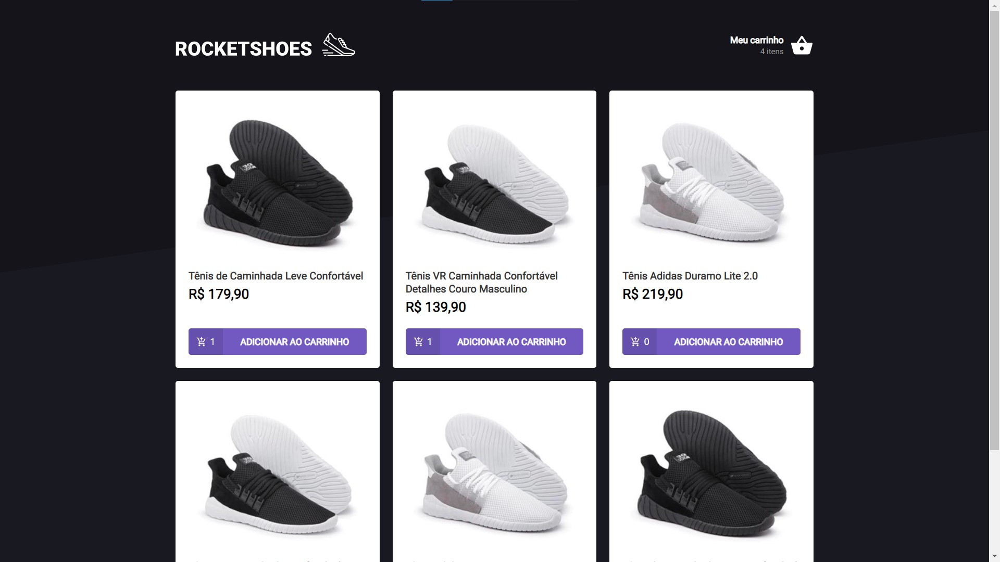
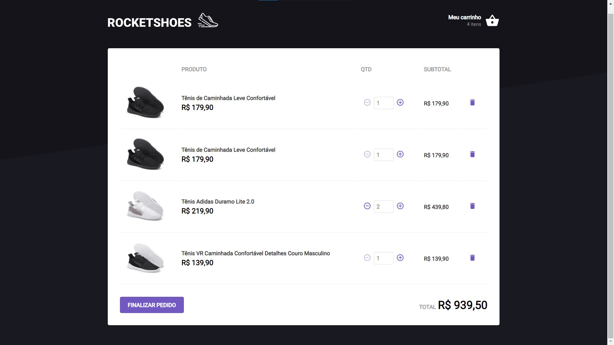

<div align="center">
  <h1>
    ⚔ Desafio — Ignite 🔥
    <br/><br/>
    Hooks customizados
  </h1>

  > Repositório com o código de resolução do desafio **Hooks customizados**, da trilha de React JS do bootcamp Ignite da Rocketseat.
</div>

<div align="center">
  

  > <small>Rocketshoes, tela inicial</small>
</div>

<div align="center">
  

  > <small>Rocketshoes, tela do carrinho</small>
</div>

## 🎉 Começando

Clone o repositório:

```bash
git clone https://github.com/MattZ6/reactjs-custom-hook-challenge
```

Adentre a pasta do projeto:

```bash
cd reactjs-custom-hook-challenge
```

Instale as dependências:

```bash
yarn
```

## 🔥 Executando

A aplicação possui uma API fake, onde seus recursos são servidos a partir de um `.json` utilizando o [json-server](https://www.npmjs.com/package/json-server).

Para "rodar" a API, execute o comando:

```bash
yarn server
```

E em seguinda, para "rodar" a aplicação, execute:

```bash
yarn start
```

## 🧪 Testando

Para "rodar" os testes, execute:

```bash
yarn test
```

___

<div align="center">
  <strong>Ignite Bootcamp 🔥</strong>
</div>
